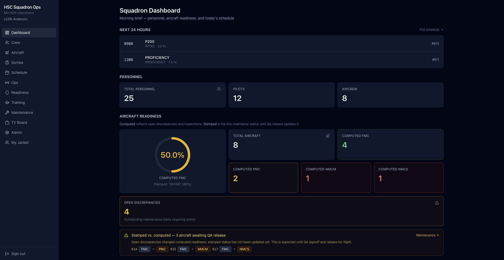
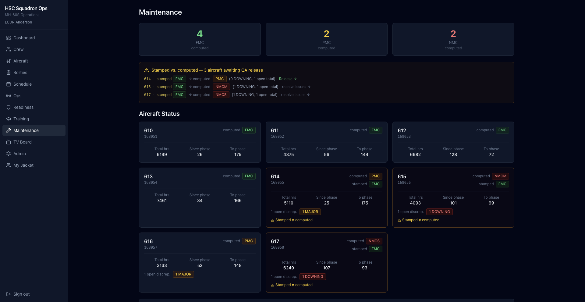
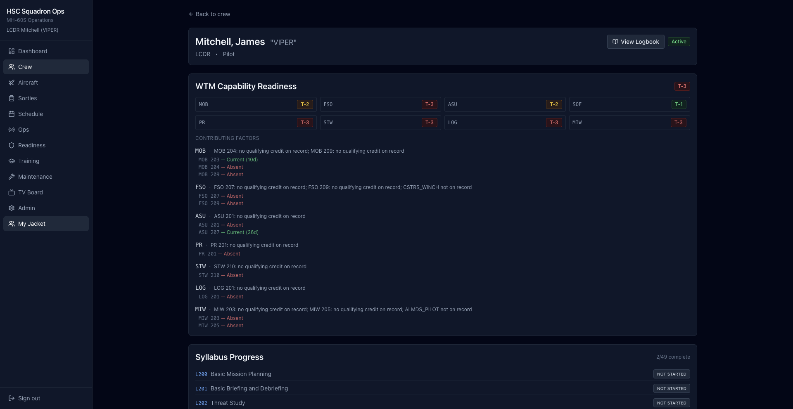
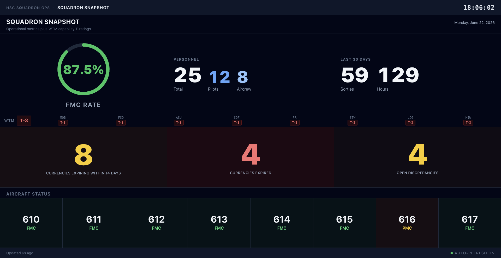

# Squadron Ops

**Integrated naval aviation operations platform** for helicopter sea combat (HSC) squadrons flying the MH-60S — and designed to extend to other Navy aviation communities. Squadron Ops unifies flight operations, digital logbook, training and readiness (Wing Training Manual), maintenance (NAMP/4790-inspired workflows), and squadron duty officer (SDO) tools in a single modern web application.

Built by a naval aviator to demonstrate credible domain modeling, full-stack engineering, and defense-relevant product thinking — the kind of integrated squadron system that today is fragmented across legacy tools (OOMA, SHARP, spreadsheets, and paper).

---

## Highlights

- **End-to-end flight cascade** — complete a sortie and watch currencies, aircraft hours, training progress, and maintenance state update from one transaction
- **WTM capability readiness** — squadron T-ratings by capability area with drill-down to anchor tasks and contributing factors
- **Maintenance fidelity** — stamped vs. computed line status, discrepancy → MAF → work order chain, inspections, QA release (safe for flight), phase and release forecasting
- **Training management** — syllabus events, gradecards, board scheduling with instructor pairing, exportable gradesheets
- **Assisted scheduling** — ranked crew suggestions and week proposals with transparent fitness warnings (human-in-the-loop)
- **SDO operations** — schedule publish, watchbill, day-of-ops status, ATO and brief-sheet PDF export
- **Fullscreen TV boards** — squadron snapshot for ready-room displays
- **54 automated backend tests** and CI pipeline (PostgreSQL → pytest → lint → production build)

---

## Screenshots

Representative views from the local demonstration environment (synthetic HSC/MH-60S data).

**Squadron Dashboard** — Morning brief with personnel counts, aircraft readiness, currency warnings, WTM capability strip, and next-24-hour sorties. One screen replaces the scattered spreadsheets and exports squadrons use today.



**Maintenance Status** — Computed vs. stamped line status, phase and release forecasts, and aircraft awaiting QA release. Surfaces stamped/computed drift before an aircraft is released safe for flight.



**WTM Readiness** — Squadron T-ratings by capability area with drill-down to per-pilot anchor tasks and contributing factors. Explainable readiness reporting aligned to Wing Training Manual structure.



**Squadron Snapshot (TV Board)** — Fullscreen ready-room display combining operational metrics, WTM ratings, currency status, and aircraft line status for daily stand-up.



---

## Tech Stack

| Layer | Technologies |
|-------|----------------|
| **Backend** | Python 3.12, FastAPI, SQLAlchemy 2.0, Pydantic, Alembic |
| **Database** | PostgreSQL 16 (Docker Compose) |
| **Frontend** | React 19, TypeScript (strict), Vite, Tailwind CSS, TanStack Query |
| **Auth** | JWT bearer tokens + role checks (`require_roles`); optional open ACL via `DEMO_OPEN_RBAC` |
| **PDF export** | WeasyPrint (readiness brief, ATO, brief sheets, gradecards, logbook) |
| **CI** | GitHub Actions |

---

## Quickstart

**Prerequisites:** Docker, Python 3.12, Node.js 20+

```bash
# One-command setup: Postgres, migrations, and realistic squadron seed data
./scripts/demo-prep.sh

# Terminal 1 — API (http://localhost:8001)
cd backend && source .venv/bin/activate && uvicorn app.main:app --reload --port 8001

# Terminal 2 — UI (http://localhost:5174)
cd frontend && npm run dev
```

Open **http://localhost:5174/login**

| Account | Role | Use case |
|---------|------|----------|
| `anderson.robert` | SDO | Schedule publish, ops console |
| `mitchell.james` | Line pilot | Crew jacket, logbook |
| `morgan.david` | Maint control | Maintenance workflows |
| `admin` | Admin | Audit log |

> **Demo credentials:** password `demo1234` for all seeded accounts. These exist only for local demonstration — never use in production.
>
> Local demo uses a built-in JWT secret (`ENVIRONMENT=development` by default). Before any internet-facing deploy, set `ENVIRONMENT=production` and a strong `SECRET_KEY` (see `.env.example`); the API will refuse to start with the demo secret or with `DEMO_OPEN_RBAC=true`.

**Guided walkthrough:** [docs/DEMO_WALKTHROUGH.md](docs/DEMO_WALKTHROUGH.md) (12 minutes)  
**Quick reference:** [docs/DEMO_QUICK_REFERENCE.md](docs/DEMO_QUICK_REFERENCE.md)

### Verify

PostgreSQL must be running (Docker Desktop + Compose; port **5433**). Without it, most pytest cases fail on connection errors.

```bash
# Full local gate (compose up → pytest → frontend test → build → lint)
./scripts/verify.sh

# Or step-by-step:
cd backend && pytest -q          # 54 tests (Postgres on :5433)
cd frontend && npm run test      # Vitest unit tests
cd frontend && npm run build
cd frontend && npm run lint      # gated in CI
```

`SKIP_COMPOSE=1` / `SKIP_LINT=1` can be set on `verify.sh` when Postgres is already up or lint should be skipped.

API URL for the SPA defaults to `http://localhost:8001`. Override with `VITE_API_BASE_URL` (see `frontend/.env.example`).

### Project status

Domain surface through assisted scheduling, SDO tools, and TV boards is **shipped**. Phases A–E engineering work is in place (quality bar, RBAC, complete integrity, module splits, route code-splitting, **Enclosure 2-shaped CBR catalog**, **Appendix D fixtures**, **per-crew landings**, **MODULE_MAP + seed package + page panel extractions**).

**RBAC:** enforced by default. For open portfolio demos, set:

```bash
export DEMO_OPEN_RBAC=true          # backend
# frontend/.env — VITE_DEMO_OPEN_RBAC=true
```

Phases A–F engineering work is complete for the portfolio demo (including responsive shell). Further domain depth (verbatim WTM Enclosure 2, configuration management, multi-squadron, password productization) is stakeholder-driven — see [ROADMAP.md](ROADMAP.md).

---

## Features

### Operations & scheduling
- Squadron dashboard with readiness metrics, currency warnings, and next-24-hour sorties
- Sortie scheduling with crew assignment, eligibility ranking, and fitness checks
- Assisted crew suggestions and weekly schedule proposals (transparent heuristics, no auto-publish)

### Flight logging & logbook
- Complete Sortie workflow with per-crewmember hours, landings, and instrument approaches
- Mission profile bulk-fill; LIVE vs. simulator (TOFT) flight modes
- Digital logbook with filtered PDF export
- Sortie completion cascade: currencies → aircraft hours → CBR task credits → discrepancies

### Readiness (WTM)
- Squadron T-ratings across eight capability areas (MOB, FSO, ASU, SOF, PR, STW, LOG, MIW)
- Table-driven anchor tasks, recency windows, and Table B-2 currency gates
- Per-area drill-down with pilot and aircrew matrices
- Exportable readiness brief PDF

### Maintenance (4790-inspired)
- Stamped vs. computed aircraft status with intentional drift scenarios in seed data
- Discrepancy lifecycle, MAF/work order chain, JCN generation
- Inspection tracking with overdue detection
- QA release workflow — release for flight / safe for flight after QA signoff
- Aircraft logbook entries, phase forecast, and release projections

### Training
- SWTP syllabus event catalog with gradecard create, fill, and PDF export
- Training board scheduling (HAC, NATOPS, Stan/Eval) with ranked instructor candidates
- Per-crewmember syllabus progress tracking

### SDO & governance
- Day-of-operations console: publish schedule, watchbill, sortie status advancement
- ATO and brief-sheet PDF export
- HTTP audit log for consequential actions
- JWT-authenticated API with role checks on sensitive routes; open ACL available via `DEMO_OPEN_RBAC`

---

## Architecture

```
┌─────────────────────────────────────────────────────────────┐
│  React SPA (TanStack Query)                                 │
│  pages · components · lib/api/ · services                   │
└──────────────────────────┬──────────────────────────────────┘
                           │ REST / JSON / JWT
┌──────────────────────────▼──────────────────────────────────┐
│  FastAPI route handlers  →  Pydantic schemas                │
└──────────────────────────┬──────────────────────────────────┘
                           │
┌──────────────────────────▼──────────────────────────────────┐
│  SQLAlchemy models  +  business logic in app/services/      │
│  (cascade, scheduling, readiness, maintenance, logbook)     │
└──────────────────────────┬──────────────────────────────────┘
                           │
┌──────────────────────────▼──────────────────────────────────┐
│  PostgreSQL 16                                              │
└─────────────────────────────────────────────────────────────┘
```

**Design principles**
- Business logic lives in `backend/app/services/`, not route handlers
- Per-crewmember flight hours on `FlightLog`, not sortie-level aggregates
- Timestamps stored in UTC; displayed in local time on the frontend
- Status semantics: green (good) · yellow (warning) · red (action required)

**Module map:** [docs/MODULE_MAP.md](docs/MODULE_MAP.md) — domain index, cascade entry points, extension recipes, demo/verify path.

**Responsive shell (Phase F):** permanent sidebar on desktop (`md`+); hamburger + overlay drawer on smaller viewports for demo-on-phone walkthroughs. Not a full mobile redesign of every page.

See [docs/PROJECT_OVERVIEW.md](docs/PROJECT_OVERVIEW.md) for API surface, data model, and capability inventory.

---

## Key routes

| Path | Purpose |
|------|---------|
| `/` | Squadron dashboard |
| `/readiness` | WTM T-ratings by capability area |
| `/maintenance` | Computed vs. stamped status, forecasts |
| `/schedule` | Flight schedule + assisted crew suggestions |
| `/ops` | SDO daily ops, ATO/brief PDFs |
| `/training` | Syllabus, gradecards, boards |
| `/logbook/:personId` | Digital logbook with PDF export |
| `/board/readiness` | Fullscreen TV squadron snapshot |
| `/admin` | Audit log |

Interactive API documentation: **http://localhost:8001/docs**

---

## Documentation

| Document | Description |
|----------|-------------|
| [docs/MODULE_MAP.md](docs/MODULE_MAP.md) | Domain index, cascade entry points, extension recipes |
| [docs/PROJECT_OVERVIEW.md](docs/PROJECT_OVERVIEW.md) | Technical overview, data model, API inventory, maturity |
| [docs/DEMO_WALKTHROUGH.md](docs/DEMO_WALKTHROUGH.md) | 12-minute guided demonstration script |
| [docs/DEMO_QUICK_REFERENCE.md](docs/DEMO_QUICK_REFERENCE.md) | Accounts, routes, troubleshooting |
| [docs/LIMITATIONS.md](docs/LIMITATIONS.md) | Known limitations, integrity risks, technical debt |
| [ROADMAP.md](ROADMAP.md) | Domain build order + engineering phases A–F |

---

## Skills demonstrated

This project is intended for review by recruiters and hiring managers in **defense technology**, **government software**, and **mission-critical systems** roles.

| Area | Evidence in this repo |
|------|----------------------|
| **Domain modeling** | WTM readiness, NAMP/4790 maintenance chain, SWTP training, MH-60S crew positions |
| **Full-stack development** | FastAPI + React/TypeScript with typed API contracts end-to-end |
| **Data integrity** | Transactional sortie-completion cascade with audit trail |
| **Complex workflows** | QA release gating, assisted scheduling with explainable rankings |
| **Document generation** | PDF exports for operational and training artifacts |
| **Testing & CI** | pytest integration suite, GitHub Actions pipeline |
| **Product judgment** | Assisted (not automatic) scheduling; stamped vs. computed status; correct naval aviation terminology |

**Relevance:** Squadron Ops demonstrates the ability to translate operational doctrine into working software — the core skill for platforms engineering, mission software, and operator-facing tools at companies serving DoD and allied defense customers.

---

## License & status

This is a **portfolio demonstration platform**. It is not affiliated with the U.S. Navy or any government entity. Unclassified synthetic data only.

For questions or a live walkthrough, open an issue or contact the repository owner.